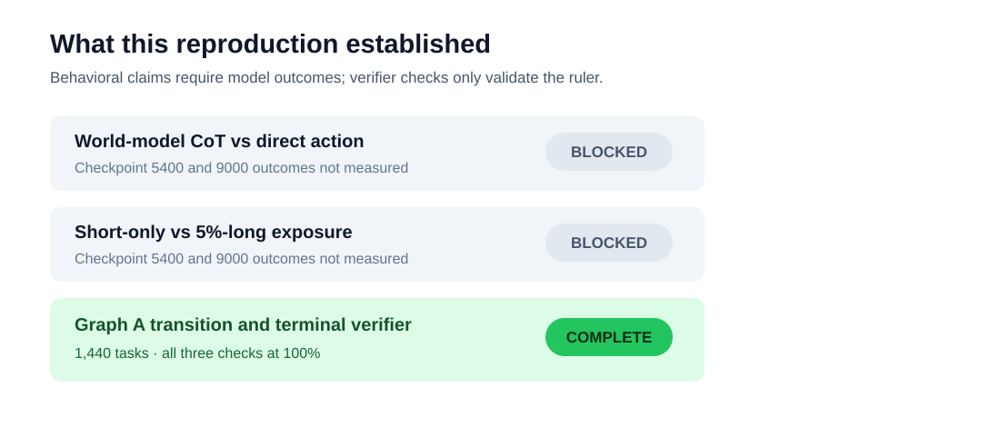
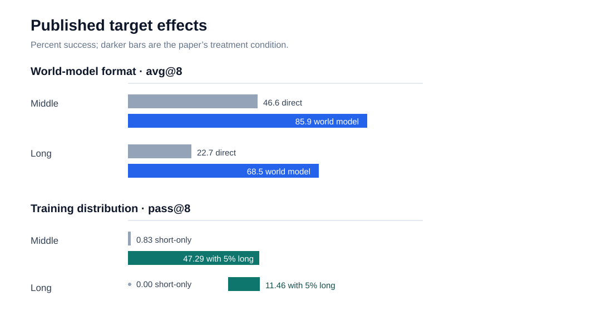
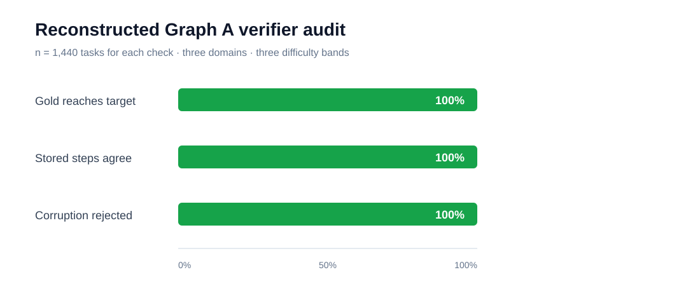
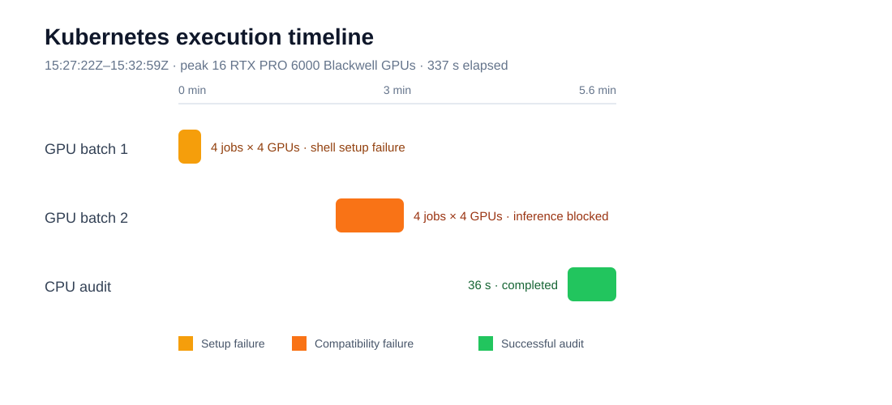

# Reproducing the pretraining claims in PlanPhys

Long plans are hard because an agent must remember what exists, predict what each action will create, and assemble many small skills in the right order. The PlanPhys paper argues that models learn this better when they explicitly reason about state changes and see even a small amount of longer training examples. We set out to test those two ideas using the authors’ released small models and held-out Graph A tasks.

## Verdict

**Not reproduced because the behavioral evaluation was blocked before inference.** The paper’s reported model ordering was not measured, so this result does not argue for or against either claim. The completed scope is narrower: a successful independent audit of the reconstructed Graph A transition and terminal-success verifier.

How to read this figure: the two gray rows are the requested outcomes and contain no observed accuracy. The green row is real Kubernetes evidence, but it validates measurement mechanics rather than model behavior.

## What the paper reports

The first comparison holds the training distribution fixed and changes the output format: direct actions versus chain-of-thought descriptions of category rules and state transitions. The second compares short-only training with a mixture containing all middle-horizon examples and 5% of long-horizon examples. At checkpoint 9000, the reported differences are large.

These are **paper numbers**, not observations from this reproduction. For world modeling, middle/long avg@8 rises from 46.6/22.7% to 85.9/68.5%. For data exposure, middle/long pass@8 rises from 0.83/0.00% to 47.29/11.46%. We also configured checkpoint 5400 to test whether either ordering survives away from the terminal checkpoint.

## Reconstructed task and audit

The public record supplies a target item, initial inventory, concrete-to-abstract index map, gold actions, and stored step count. The public domain configuration supplies item categories and Graph A transition rules. The verifier maps each material to its recipe node, checks a one- or two-input rule, adds the concrete output to inventory, preserves prerequisites, and succeeds only when the named target is present.

We deterministically selected 160 records in each domain/difficulty cell, stratified over exact gold length: 3 domains × 3 difficulties × 160 = 1,440 tasks. Three preregistered self-checks all passed.

- Every released gold trajectory reached its target.
- Every gold trajectory length equaled `total_step_nums`.
- Replacing one material in the terminal gold action caused every trajectory to miss the target.

This supports the reconstructed semantics. It cannot establish how either checkpoint behaves, and it does not validate unspecified sampling details in the paper’s final 160-task subsets.

## Why behavioral evidence is absent

Four matched 4-GPU jobs covered final and intermediate checkpoints for both claims. The first attempt failed because the injected Kubernetes script needed a nested shell. The repaired attempt downloaded only the required public artifacts, loaded 1,440 tasks, passed the verifier audit, and then stopped when the tokenizer emitted `token_type_ids` that the model’s generation method rejects. Under the experiment-tree repair cap, a third setup attempt on the same nodes was not permitted.

The successful CPU audit ran after the GPU jobs and completed in 36 seconds. Kubernetes was used throughout on a cluster with NVIDIA RTX PRO 6000 Blackwell GPUs. Peak concurrent GPU allocation was 16. From first GPU job creation (15:27:22Z) to audit completion (15:32:59Z), actual elapsed wall time was 337 seconds, or 0.094 hours.

## Claim-by-claim assessment

| Claim | Paper evidence | Observed evidence | Assessment |
|---|---|---|---|
| World-model CoT improves middle/long planning | +39.3/+45.8 points avg@8 | No model outcomes | Inconclusive under this setup |
| Limited long-horizon exposure improves composition | +46.46/+11.46 points pass@8 for middle/long | No model outcomes | Inconclusive under this setup |
| Ordering spans domains, formatting, and checkpoints | Three domains; checkpoint curves | Parser modes and checkpoint 5400 configured, not executed | Not attempted behaviorally |
| Reconstructed outcome verifier matches records | Gold trajectories and stored lengths | Three 100% checks, n=1,440 | Aligned method audit |

## Implementation and limitations

The public implementation is in `planphys/evaluate.py`; conditions live in `experiment_config.json`; Kubernetes shape lives in `.orx/k8s.yaml`. `main` includes the diagnosed compatibility fix (`return_token_type_ids=False`) but that change is explicitly unmeasured. Detailed provenance is in the [README experiment log](../../README.md), with immutable links to each experiment branch.

The gym, official evaluator, exact final-task indices, and stored model generations remain unreleased. Checkpoint evaluation would test released behavior, not original training provenance. A complete follow-up needs one authorized post-cap run of the four existing conditions—without tuning to paper numbers—followed by the planned paired bootstrap and strict/lenient parser analysis.

